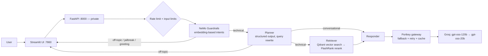

# Enterprise Agentic RAG

An agentic Retrieval-Augmented Generation assistant for enterprise IT documentation (Kubernetes, Intel hardware, networking) — with guardrails, an LLM gateway, **a confidence signal that tells users when the docs don't support an answer**, and **an offline evaluation pipeline that measures quality instead of guessing it**.

**Live demo:** https://agentic-rag-d.streamlit.app

**Try:** "In the nginx HPA example, what replica range is used?" · "What roles do etcd and kube-apiserver play?" · "How do I set up Istio mTLS?" (not in docs) · "tell me a joke" (guardrail)

> The demo sleeps when idle — the first question after a wake-up can take about a minute while models load.

Built entirely on free tiers (Groq, Gemini, Qdrant Cloud, Portkey, Logfire, Streamlit Community Cloud).

---

## What makes it different

**1. It knows when it doesn't know.** Every answer carries a confidence badge computed from the cross-encoder relevance of the retrieved passages — not from the LLM's own opinion:

| Badge | Meaning |
|---|---|
| 🟢 High | A retrieved passage closely matches the question |
| 🔵 Medium | Related passages, may not fully answer it |
| 🟠 Low | Only weakly related passages — verify before relying on it |
| ⚪ Not in docs | Nothing relevant retrieved; any guidance is labelled as general knowledge |

Thresholds are calibrated on this corpus: passages that answered golden questions scored 0.98–0.99; unrelated ones ~0.0.

**2. Quality is measured.** A golden dataset + LLM-as-judge pipeline (Ragas) scores retrieval and generation separately — see [Evaluation](#evaluation) for the numbers and what they revealed.

---

## Architecture



| Layer | Choice | Why |
|---|---|---|
| Orchestration | LangGraph (planner → retriever → responder) with per-thread memory | Explicit, inspectable agent flow |
| Guardrails | Layer 1: NeMo Guardrails, `embeddings_only` intent matching · Layer 2: planner LLM `off_topic` intent | Layer 1 is free and instant for common cases; layer 2 generalises to any topic at no extra LLM call (the planner already runs) |
| Retrieval | Gemini embeddings → Qdrant Cloud → FlashRank `ms-marco-MiniLM-L-12-v2`, min-score cutoff | Cross-encoder reranking removes irrelevant chunks before they reach the LLM |
| Generation | Grounded prompt with `[n]` citations; explicit "not in the docs" path | Reduces hallucination |
| Gateway | Portkey: primary/fallback models, retries, caching | Resilience on free-tier rate limits |
| Observability | Pydantic Logfire spans across UI → API → agent | End-to-end traces |

---

## Evaluation

`evals/` contains a reproducible pipeline:

1. **`golden_dataset.json`** — 20 hand-verified questions across 6 source documents (fact, multi-part, reasoning, comparison, out-of-scope). Every ground-truth fact was checked against its source.
2. **`pipeline.py`** — runs each question through the real system (guardrails → graph), records answer, retrieved contexts, sources, latency; crash-safe JSONL with resume; records git commit + models per run.
3. **`metrics.py`** — Ragas Context Recall / Context Precision / Faithfulness / Answer Relevancy with an LLM judge; applicability rules (N/A is never averaged as 0); the judge sees exactly the context the LLM saw.
4. **`judge.py`** — judge adapters for Ragas and DeepEval with a sliding-window token budget that keeps runs inside Groq's free-tier limits.
5. **`refusal.py`** — honest-refusal check for out-of-scope questions (rule-based, no LLM).
6. **`guardrails_eval.py`** — runs `guardrails_dataset.json` (should-block vs should-pass messages) through both guardrail layers and reports each layer and the combined system.

### What each metric means

| Metric | Question it answers | Measures |
|---|---|---|
| Source hit rate | Did retrieval return the document the answer lives in? | Retrieval |
| Context Recall | Do the retrieved passages contain the facts needed for the correct answer? | Retrieval |
| Context Precision | Are the relevant passages ranked above the irrelevant ones? | Retrieval / reranking |
| Faithfulness | Is every claim in the answer supported by the retrieved passages (no hallucination)? | Generation |
| Answer Relevancy | Does the answer address the question that was asked? | Generation |

All scores are 0–1, higher is better. Retrieval and generation are scored separately so a bad answer can be traced to its cause: wrong passages, or a wrong use of the right passages.

### Baseline results (before retrieval fixes)

| Metric | Score | n |
|---|---|---|
| Source hit rate | 0.71 | 17 |
| Context Recall | 0.69 | 17 |
| Context Precision | 0.74 | 17 |
| Faithfulness | 0.78 | 15 |
| Answer Relevancy | 0.73 | 17 |

Run `20260927-112048` · judge `openai/gpt-oss-20b` · all 17 in-scope goldens scored, 0 judge errors. The 3 out-of-scope goldens have no correct passage to find, so these metrics don't apply to them.

**Why `n` differs:** a metric that does not apply is marked N/A and left out of the average — never counted as 0. Faithfulness has n=15 because two questions retrieved nothing, and an answer cannot be faithful or unfaithful to no context (their Context Recall/Precision *are* counted, as a measured 0).

**Rate limits:** scoring takes ~15k judge tokens per golden, and Groq's free tier allows 200k per day. The run hit the daily limit after 13 goldens; because results are written per golden and the scorer resumes, the remaining ones were scored the next day against the same answers, the same judge and the same code — so all 17 are comparable.

### Out-of-scope questions: honest refusal

The 3 out-of-scope goldens ask about things the docs don't cover (Juniper BGP, Argo CD, Istio mTLS). Retrieval metrics don't apply to them, so they are scored by rules instead of an LLM — free and identical on every run. An answer passes only if it (1) says up front that the docs don't cover it, (2) labels any extra advice "General guidance (not from the docs)", and (3) cites no document excerpts.

| Metric | Score | n |
|---|---|---|
| Honest refusal rate | 1.00 | 3 |

One of the three retrieved unrelated chunks and still refused correctly rather than stretching them into an answer.

### Guardrails

`guardrails_dataset.json` has 37 messages in three splits — messages that should be blocked (off-topic, jailbreak) and technical questions that must pass, including traps like *"How do I **kill** a stuck pod?"* or *"How do I **override** the default resource limits?"*:

- **dev** (10) — the original set, used to diagnose the problem
- **tune** (14) — written before any change, then used while tuning
- **test** (13) — written *after* the tuning data was seen and only scored once at the end, so it is the honest measure of generalisation

The gate matches intents by embedding similarity (no LLM call, ~0.02s), so the eval is free and deterministic. NeMo's threshold is **not a cosine**: it scores `1 - sqrt(2 - 2*cos)/2`, so the original 0.6 required a cosine of about 0.68 — only near-copies of an example phrase were caught.

| Config | Block rate — dev | tune | **test** | False-block rate (all splits) |
|---|---|---|---|---|
| Before: threshold 0.6, original examples | 0.40 | 0.00 | **0.00** | 0.00 (n=17) |
| After: threshold 0.45, examples by category, 16 technical examples | 1.00 | 1.00 | **0.14** | 0.00 (n=17) |

What changed: off-topic and jailbreak examples were added by category (sports, food, creative writing, "no rules" and persona jailbreaks, prompt extraction), and the technical intent got 16 examples so that a real question's closest match is technical — that is what made lowering the threshold safe (0 false blocks).

**What the test split showed:** dev and tune reached 100%, but unseen off-topic topics (party planning, stocks, smartphones, translation) were still missed. An example list cannot enumerate every off-topic subject, so embedding matching can only be a fast first layer for common cases.

**Layer 2 — the planner.** The planner LLM already classifies every message that passes layer 1 (conversational vs technical), so it got a third intent, `off_topic`, at no extra LLM call. Off-topic messages get the same fixed reply as the rail, skipping retrieval and the responder. Its prompt states that technical questions the docs don't cover (Istio, Argo CD, Juniper) are still *technical* — so they keep getting the honest "not in docs" answer. The eval adds the 20 RAG goldens as must-pass questions for this layer:

| Split | Layer 1 block | Layer 2 block | **System block** | System false-block |
|---|---|---|---|---|
| dev | 1.00 (5) | 1.00 (5) | **1.00** | 0.00 (5) |
| tune | 1.00 (8) | 1.00 (8) | **1.00** | 0.00 (6) |
| test | 0.14 (7) | 1.00 (7) | **1.00** | 0.00 (6) |
| goldens (incl. 3 out-of-scope) | — | — | — | **0.00 (20)** |

Honest caveats: the planner's off-topic categories (shopping, finance, translation…) were written after the test misses had been seen, so for layer 2 the test split is not fully unseen; the samples are small (7 test block cases); and the planner is an LLM, so repeated runs can differ. A fresh set of unseen messages is the next check.

### What the evals found

- **A document that was never indexed.** All three CronJob questions missed their source: ingestion had silently dropped `cronjobs.docx` (errors were only logged). Found by the first eval run, not by manual testing.
- **Whole documents stored as single chunks.** VPA questions returned "not in docs" although the answer exists: the article was one 17.7k-character chunk and the cross-encoder only reads the first ~512 tokens, where only HPA content is. The same file answered HPA questions correctly.
- **Judge choice changes scores.** The same answer scored Faithfulness 0.68 with a Qwen judge and 1.0 with gpt-oss-20b — so runs are only compared under the same judge, and verdicts are spot-checked.
- **The judge can be lenient.** A spot-check of `hpa-003` (HPA vs VPA) found Faithfulness 1.0 although the answer included details ("stateless", "batch jobs") that were not in the trimmed context the LLM saw. Its Context Recall of 0.0 is accurate — it is the oversized-chunk problem again: the VPA part of the 17.7k-character chunk is trimmed away before the LLM sees it.

---

## Engineering notes

Problems solved while building this, each diagnosed by measuring rather than guessing:

- **Model retirement:** the original Llama models were retired by the provider; migrated to gpt-oss and re-validated.
- **Reasoning-model quirks:** gpt-oss ignored NeMo's completion-style intent prompt and occasionally duplicated free-text output → switched guardrails to embedding-based intents and the planner to JSON-schema structured output.
- **Dependency conflict:** Ragas 0.4.3 required a module removed in `langchain-community` 0.4 → found (via `pip --dry-run` and wheel metadata) that 0.3.31 is the last compatible release, and pinned it.
- **Library telemetry timeouts:** each Ragas score took ~40s because its analytics calls timed out on the network → disabled telemetry (40× faster).
- **Free-tier limits beyond the headers:** reproduced Groq's hidden output-tokens-per-minute limit with concurrent requests, switched judge models, and built a token-budget limiter that settles on actual usage.
- **Safe public demo:** input length limits, global rate limiting, private API behind the UI, per-session memory threads, no secrets in the image.

---

## Run locally

```bash
python -m venv .venv && source .venv/bin/activate
pip install -r requirements.txt
cp .env.example .env   # fill in your keys
uvicorn app.main:app --port 8000          # terminal 1
streamlit run ui/app.py                   # terminal 2
```

Evaluation:
```bash
python -m evals.pipeline                  # run the golden set through the system
python -m evals.metrics --run <RUN_ID>    # score it (re-run the same command to resume after a rate limit)
python -m evals.refusal --run <RUN_ID>    # honest refusal on out-of-scope goldens (no LLM)
python -m evals.guardrails_eval --planner # guardrail layers (omit --planner for the free layer-1-only run)
```

Docker:
```bash
docker build -t enterprise-rag .
docker run -p 7860:7860 --env-file .env enterprise-rag
```

Required environment variables: `GROQ_API_KEY`, `GROQ_FALLBACK_API_KEY`, `PORTKEY_API_KEY`, `GEMINI_API_KEY`, `QDRANT_CLUSTER_ENDPOINT`, `QDRANT_API_KEY`; optional: `LOGFIRE_TOKEN`, `LANGSMITH_API_KEY` (set `LANGSMITH_TRACING=false` without it), `JUDGE_GROQ` (evals).

---

## Known limitations & roadmap

- **Chunking:** PDFs/HTML without paragraph breaks become single oversized chunks → add a size-bounded splitter with overlap and re-ingest (the eval pipeline is in place to measure the gain).
- **Confidence is wording-sensitive** until chunking is fixed: the reranker only reads the start of oversized chunks, so rephrasing can move the same correct answer from Low (0.24) to High (0.86). The badge errs toward under-confidence, not over-confidence.
- **Ingestion reliability:** failures are logged, not surfaced → add a per-file ingestion report and a post-ingest verification of chunk counts in Qdrant.
- **Memory** is in-process (`MemorySaver`) → move to a persistent checkpointer (Postgres).
- **Judge bias:** the judge shares a model family with the answer model → spot-check verdicts; move to a cross-family judge when limits allow.
- **Guardrails:** two layers now (embeddings + planner LLM), but the planner is evaluated on a small set that influenced its prompt → evaluate on a fresh, larger unseen set; add a dedicated prompt-injection classifier for injections hidden inside long technical questions.
