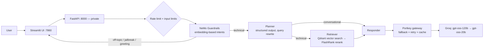

# Enterprise Agentic RAG

An agentic Retrieval-Augmented Generation assistant for enterprise IT documentation (Kubernetes, Intel hardware, networking) — with guardrails, an LLM gateway, **a confidence signal that tells users when the docs don't support an answer**, and **an offline evaluation pipeline that measures quality instead of guessing it**.

**Live demo:** _add your Hugging Face Space link here_

Built entirely on free tiers (Groq, Gemini, Qdrant Cloud, Portkey, Logfire, Hugging Face Spaces).

---

## What makes it different

**1. It knows when it doesn't know.** Every answer carries a confidence badge computed from the cross-encoder relevance of the retrieved passages — not from the LLM's own opinion:

| Badge | Meaning |
|---|---|
| 🟢 High | A retrieved passage closely matches the question |
| 🔵 Medium | Related passages, may not fully answer it |
| 🟠 Low | Only weakly related passages — verify before relying on it |
| ⚪ Not in docs | Nothing relevant retrieved; any guidance is labelled as general knowledge |

Thresholds are calibrated on this corpus: passages that answered golden questions scored 0.98–0.99; unrelated ones ~0.0.

**2. Quality is measured.** A golden dataset + LLM-as-judge pipeline (Ragas) scores retrieval and generation separately, and the numbers are shown in the app's sidebar.

---

## Architecture



| Layer | Choice | Why |
|---|---|---|
| Orchestration | LangGraph (planner → retriever → responder) with per-thread memory | Explicit, inspectable agent flow |
| Guardrails | NeMo Guardrails, `embeddings_only` intent matching | Deterministic, 0 LLM calls per check |
| Retrieval | Gemini embeddings → Qdrant Cloud → FlashRank `ms-marco-MiniLM-L-12-v2`, min-score cutoff | Cross-encoder reranking removes irrelevant chunks before they reach the LLM |
| Generation | Grounded prompt with `[n]` citations; explicit "not in the docs" path | Reduces hallucination |
| Gateway | Portkey: primary/fallback models, retries, caching | Resilience on free-tier rate limits |
| Observability | Pydantic Logfire spans across UI → API → agent | End-to-end traces |

---

## Evaluation

`evals/` contains a reproducible pipeline:

1. **`golden_dataset.json`** — 20 hand-verified questions across 6 source documents (fact, multi-part, reasoning, comparison, out-of-scope). Every ground-truth fact was checked against its source.
2. **`pipeline.py`** — runs each question through the real system (guardrails → graph), records answer, retrieved contexts, sources, latency; crash-safe JSONL with resume; records git commit + models per run.
3. **`metrics.py`** — Ragas Context Recall / Context Precision / Faithfulness / Answer Relevancy with an LLM judge; applicability rules (N/A is never averaged as 0); the judge sees exactly the context the LLM saw.
4. **`judge.py`** — judge adapters for Ragas and DeepEval with a sliding-window token budget that keeps runs inside Groq's free-tier limits.

### Baseline results (before retrieval fixes)

| Metric | Score | n |
|---|---|---|
| Source hit rate (right document retrieved) | 0.71 | 17 |
| Context Recall | 0.60 | 13 |
| Context Precision | 0.67 | 13 |
| Faithfulness | 0.75 | 11 |
| Answer Relevancy | 0.71 | 13 |

Judge: `openai/gpt-oss-20b`. 13 of 17 in-scope questions were scored before the judge's free daily token quota ran out.

### What the evals found

- **A document that was never indexed.** All three CronJob questions missed their source: ingestion had silently dropped `cronjobs.docx` (errors were only logged). Found by the first eval run, not by manual testing.
- **Whole documents stored as single chunks.** VPA questions returned "not in docs" although the answer exists: the article was one 17.7k-character chunk and the cross-encoder only reads the first ~512 tokens, where only HPA content is. The same file answered HPA questions correctly.
- **Judge choice changes scores.** The same answer scored Faithfulness 0.68 with a Qwen judge and 1.0 with gpt-oss-20b — so runs are only compared under the same judge, and verdicts are spot-checked.

---

## Engineering notes

Problems solved while building this, each diagnosed by measuring rather than guessing:

- **Model retirement:** the original Llama models were retired by the provider; migrated to gpt-oss and re-validated.
- **Reasoning-model quirks:** gpt-oss ignored NeMo's completion-style intent prompt and occasionally duplicated free-text output → switched guardrails to embedding-based intents and the planner to JSON-schema structured output.
- **Dependency conflict:** Ragas 0.4.3 required a module removed in `langchain-community` 0.4 → found (via `pip --dry-run` and wheel metadata) that 0.3.31 is the last compatible release, and pinned it.
- **Library telemetry timeouts:** each Ragas score took ~40s because its analytics calls timed out on the network → disabled telemetry (40× faster).
- **Free-tier limits beyond the headers:** reproduced Groq's hidden output-tokens-per-minute limit with concurrent requests, switched judge models, and built a token-budget limiter that settles on actual usage.
- **Safe public demo:** input length limits, global rate limiting, private API behind the UI, per-session memory threads, no secrets in the image.

---

## Run locally

```bash
python -m venv .venv && source .venv/bin/activate
pip install -r requirements.txt
cp .env.example .env   # fill in your keys
uvicorn app.main:app --port 8000          # terminal 1
streamlit run ui/app.py                   # terminal 2
```

Evaluation:
```bash
python -m evals.pipeline                  # run the golden set through the system
python -m evals.metrics --run <RUN_ID>    # score it
python -m evals.export_scorecard --run <RUN_ID>
```

Docker:
```bash
docker build -t enterprise-rag .
docker run -p 7860:7860 --env-file .env enterprise-rag
```

Required environment variables: `GROQ_API_KEY`, `GROQ_FALLBACK_API_KEY`, `PORTKEY_API_KEY`, `GEMINI_API_KEY`, `QDRANT_CLUSTER_ENDPOINT`, `QDRANT_API_KEY`; optional: `LOGFIRE_TOKEN`, `LANGSMITH_API_KEY` (set `LANGSMITH_TRACING=false` without it), `JUDGE_GROQ` (evals).

---

## Known limitations & roadmap

- **Chunking:** PDFs/HTML without paragraph breaks become single oversized chunks → add a size-bounded splitter with overlap and re-ingest (the eval pipeline is in place to measure the gain).
- **Ingestion reliability:** failures are logged, not surfaced → add a per-file ingestion report and a post-ingest verification of chunk counts in Qdrant.
- **Memory** is in-process (`MemorySaver`) → move to a persistent checkpointer (Postgres).
- **Judge bias:** the judge shares a model family with the answer model → spot-check verdicts; move to a cross-family judge when limits allow.
- **Guardrails:** embedding matching can miss heavily reworded jailbreaks → add a dedicated prompt-injection classifier.
